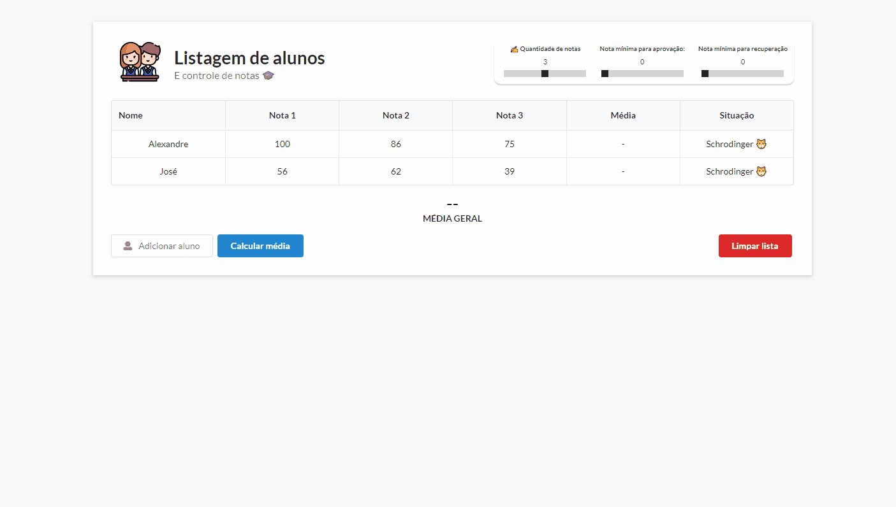

<h1 align="center">Gerenciador de alunos</h1>

 <a href="#description">Descrição</a> •
 <a href="#stacks">Tecnologias</a> • 
 <a href="#updates">Atualizações</a> • 
 <a href="#deploy"><a href="https://alexandresouva.github.io/gerenciador-de-alunos/" target="_blank"> Deploy (Git Hub Pages)</a></a>

<strong></strong> 

<h2 id="description">📑 Descrição do projeto</h2>

Sistema para listagem de alunos e atribuição de notas. Permite o cálculo de
a média individual e coletiva. 

O objetivo é explorar conceitos de **manipulação de DOM** (JavaScript), utilização de **funções semânticas** e experimentar um novo framework CSS **(Semantic UI)**.

### Funcionalidades:

- Controlar critérios como nota mínima de aprovação e também de recuperação;
- Permitir a adição de novos alunos na tabela.
- Alterar a quantidade de notas, manipulando a tabela através do JavaScript. 
- Resetar todos os dados da tabela;

<h2 id="stacks">👨‍💻 Tecnologias</h2>

**Front-end:** HTML, CSS, Semantic UI e JavaScript (vanilla).

<h2 id="updates">📈 Atualizações futuras</h2>

Pretendo ainda implementar: 

- [ ] Opção para editar dados de alunos já cadastrados.
- [ ] Opção para remover alunos individualmente e não somente limpando toda a lista. 

<h2 id="deploy">📈 Deploy</h2>

Disponível no <a href="https://alexandresouva.github.io/gerenciador-de-alunos/" target="_blank">Git Hub Pages.</a>
